+++
title = '感恩节俄勒冈游记'
date = 2024-01-31T23:08:53-08:00
tags = [
    "travel",
]
description = "感恩节周末来俄勒冈4天旅行，第一次记录旅游行程。"
author = "jumbo chow"
categories = ["travel"]
aliases = ["/p/感恩节俄勒冈游记/"]
feature = "oregon_cover.png"
+++

## 星期四11月23日 进入俄勒冈
11月23日星期四上午10点10分左右，我们从家里出发，开始了去俄勒冈的旅程。沿着5号州际公路开车3个小时以后，我们进入俄勒冈州。下了州际公路又沿着哥伦比亚河岸公路开了30来分钟，终于抵达了美西北最早的定居点小城阿斯托里亚（Astoria）。因为是感恩节，基本上所有室内活动都关停，很遗憾的所有博物馆的参观和Astoria Column都没能去成。大家只能先在Safeway超市买了点吃的，补充能量。

经过简单的休整，我们来到附近的Columbia River Maritime Museum，在这个博物馆的外围活动。博物馆坐落在哥伦比亚河出海口附近的岸边，独特的风帆造型非常吸引眼球。我们在博物馆边上的河岸和码头周边欣赏了一下河口的景色，看着大河浩浩荡荡奔流入海。虽然被大风吹得头发狂舞，我们还是被眼前的景色所震撼，绵长的阿斯托了亚-梅格勒大桥横跨宽阔的河口，真正是天堑变通途。这座跨海大桥连接着俄勒冈的阿斯托里亚和华盛顿州的梅格勒，在5号州际公路修好之前，作为主要的连接华盛顿州和俄勒冈州的通道，承担着货物运输和人员流动的重任。在博物馆的玻璃窗里，我们看见了一个写满飓风名字的海报，介绍了一直到2026年的飓风名字，小朋友看了倍感新鲜。

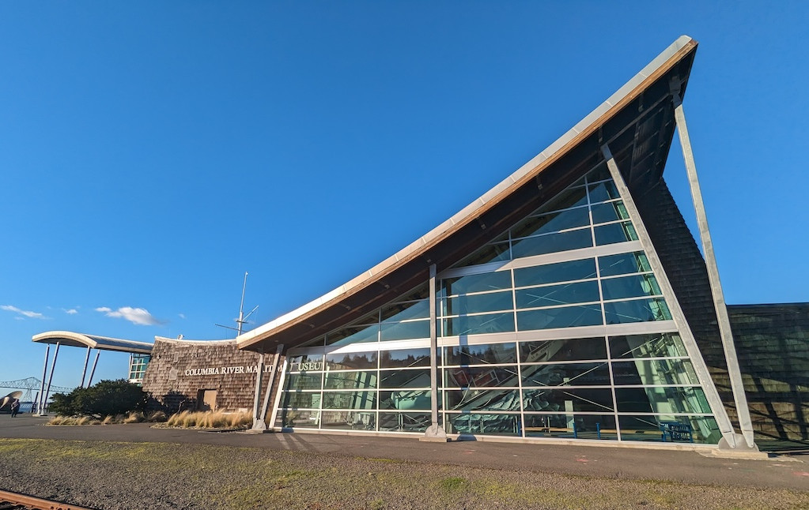
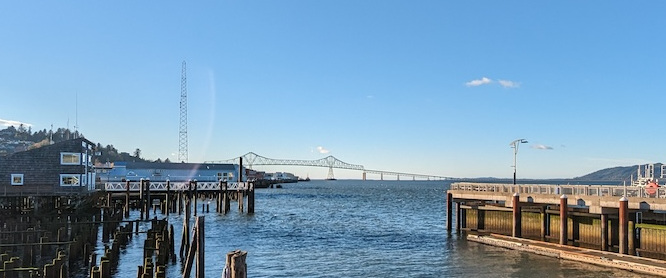

离开博物馆，我们决定到附近的史蒂文斯堡州立公园（Fort Stevens State Park）探索一下船只残骸的遗址（Wreck of Peter Iredale）。

从博物馆出发，驶上101号公路，穿越另一座跨海大桥New Youngs Bay Bridge，不久就进入了州立公园。沿着公园里蜿蜒的小径，我们抵达了海滩沙丘，下车登上沙丘顶端，发现了一片船头残骸。

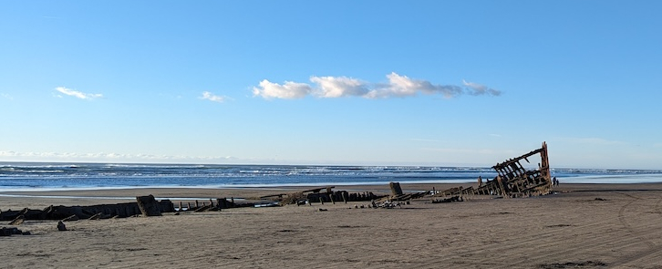

带着孩子们悠然走近，棕黄的沙滩上，模糊地可以看到一艘船的残骸隐匿在沙中。露出沙面的部分已然斑驳腐朽，唯一清晰可见的是船头的高耸形态，坚韧地诉说着这艘商船的历史。

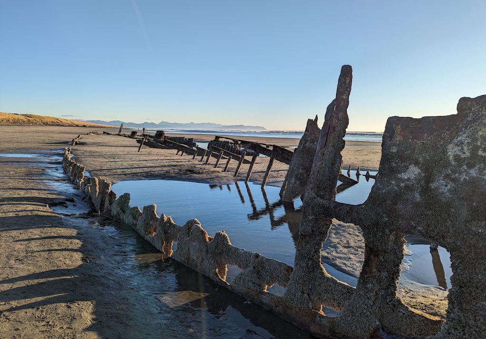

船头的钢结构上布满了藤壶和锈迹，格子的纹理在夕阳的照射下形成了一道道光栅，呈现出令人陶醉的美景。

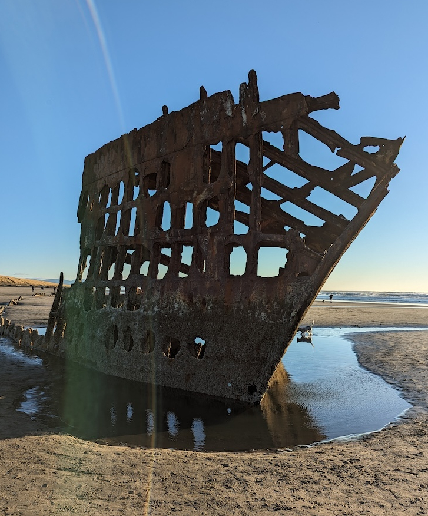

孩子们在残骸附近嬉戏着玩起了泥沙，而大人们则围绕着残骸、形成的小溪以及沙滩，一边欣赏一边拍照。

随着天色逐渐变暗，我们告别了这片记录了历史的海滩，匆忙前往附近小城Seaside的旅馆，为今日的冒险画上一个圆满的句号，静享休憩时光。

## 星期五11月24号 海边
早上整装出发，虽然一早气温只有不到30华氏度，屋顶和草坪上都是霜，但是天气很好，烈日当空，万里无云。

清理了车窗上的残冰后，我们首先驾车来到附近Seaside的海岸边。站在高出海滩的石头岸边，眼前展现的是一条条洁白的海浪，缓慢而迅猛地不断地涌向沙滩。巨大的轰鸣声在耳边回荡，提醒着我们大自然的威力。在白浪之间或白浪之上，隐约可见到一些黑色的小点，仔细一看，原来是在寒风中冲浪的勇士们。他们时而站在冲浪板上，挑战汹涌的浪潮，时而匍匐在板上，顺势而行，有时整个人隐没在浪中，令人不禁为他们捏一把汗。

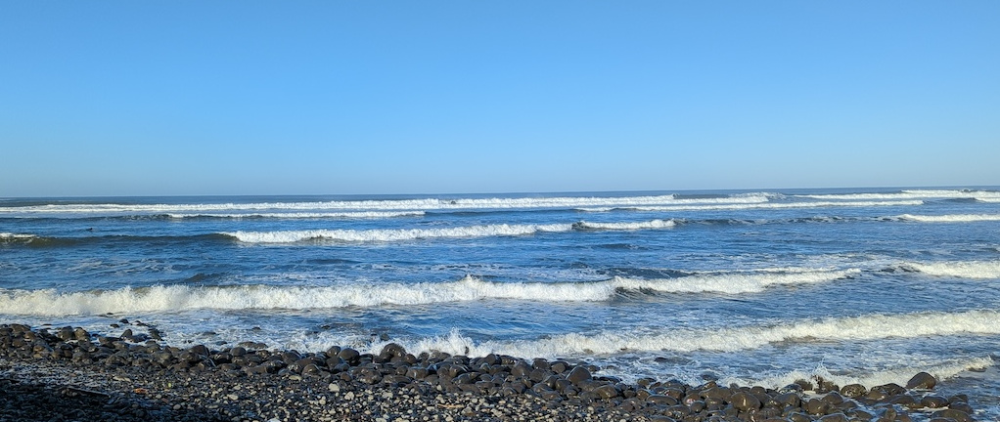

碧海蓝天，白浪黄沙，勇敢的冲浪者们犹如点缀这片海滩的一抹亮色，展现出冬日Seaside海滩的生机勃勃和活力。

离开Seaside，我们驱车来到南面不远的旅游胜地加农海滩（Cannon Beach），这个大名鼎鼎的滨海小镇。小城虽然规模不大，却以其迷人的海滩和海平面上突兀的草垛岩（Haystack Rock）而著称。这次来加农海滩，天气成为最大的惊喜，阳光普照，蓝天搭配万里无云，虽然气温不高，但温暖的阳光让人感到无比慵懒放松。

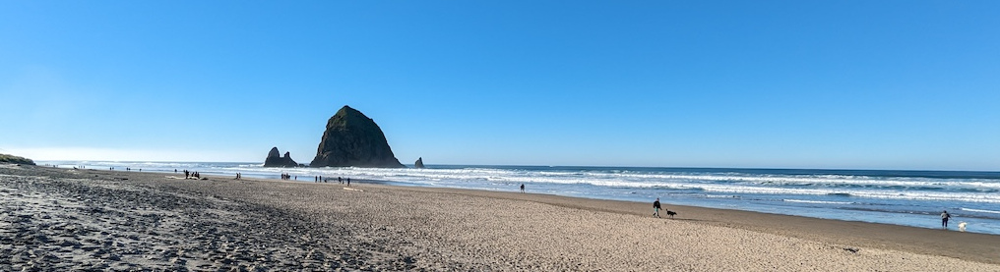

漫步在海滩上，人们纷纷将目光投向碧海金沙，以及海平面上屹立的草垛岩和周围几座小一点的礁石，纷纷按下手机相机上的快门。海滩上生气勃勃，人们散布在沙滩上，有的成群结队，有的搀扶着彼此，赤脚踏入海水的细沙中，有的徜徉在泥沙之上，欣赏着海天一色波澜壮阔。大人们低声交谈，孩子们兴奋地嬉戏，甚至狗狗们也欢快地奔跑，在沙滩上留下自己的痕迹。这一切在汹涌的海浪声中交织成一幅欢乐生动的画卷。朝南眺望，海面上弥漫着白茫茫的雾气，沙滩上的树木、房屋和人群若隐若现，如诗如画，美不胜收。

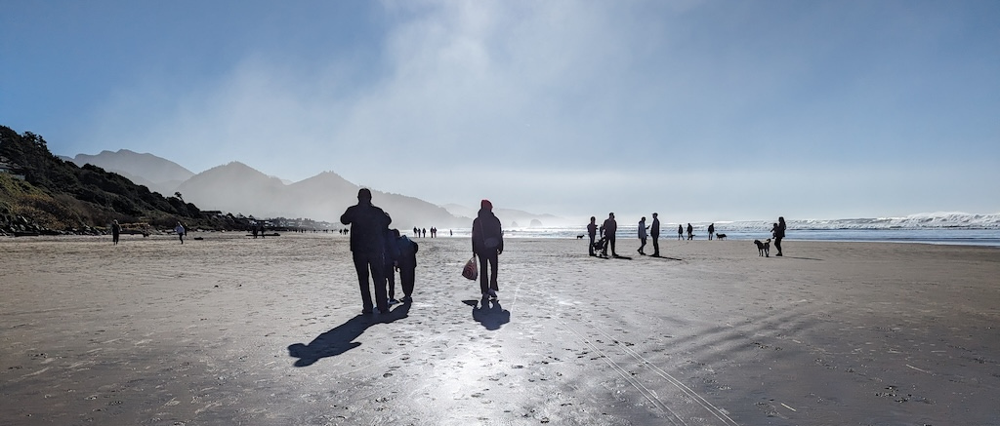

中午时分，我们在海滩附近简单用餐，同时商量之后的去处。在旅游宝典小红书的指引下，我们决定去城北不远处的Ecola State Park。蜿蜒的山路虽然不长，但是及其狭窄，两边是或徐或急的山坡，排列着参天大树和灌木，两车相向而行需要格外小心，以免发生意外。开出山林到山顶停车场时，眼前豁然开朗。只见停车场正对着浩瀚的大海和海岸线上的峭壁、沙滩。我们可以俯瞰着完整的加农海滩，以及远近各处不知名的海滩。几个小时以前我们还身在加农海滩近距离欣赏沙滩海浪，草垛岩以及一望无际的大海，此时却遥望着那片神奇地方，并且更加完整地观察大自然的鬼斧神工，感受着“上帝视角”的奇妙效果。

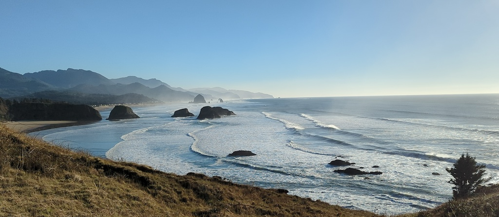

太阳很快就西斜了，我们的车很快的开上了26号公路，向波特兰方向进发。一个半小时以后，我们抵达了波特兰附近的旅馆--位于Beaverton的Fairfield Inn By Marriott，结束了今天的旅程。

## 星期六11月25号 哥伦比亚河谷
中午从旅馆出发，我们开上了84号州际公路，驶向哥伦比亚河谷的两个壮丽景点。与之前两次造访哥伦比亚河谷不同，今天的天气十分捧场，蔚蓝的天空依然是万里无云，明媚的阳光洒满大地。

与前一天在加农海滩的碧海蓝天、波涛汹涌的景象不同，今天我们一路驶过哥伦比亚河畔，碧绿的河水时隐时现。两岸起伏的丘陵山地覆盖着郁郁葱葱的常青树林和点缀其中的金黄色落叶树林，阳光照射下，色彩斑斓，令人目眩神迷。

首先到达Crown Point Vista House。这是一座位于峭壁之上的观景塔，类似于岳阳楼之于长江，不过乃是简化版本。建筑只有三层，底层是一个小小的展厅和纪念品商店；中间层是一个圆形的大厅，设有咨询台，为游客提供避风和咨询服务；上层则是一个观景台，可以360度环绕，尽情欣赏河谷的美景。

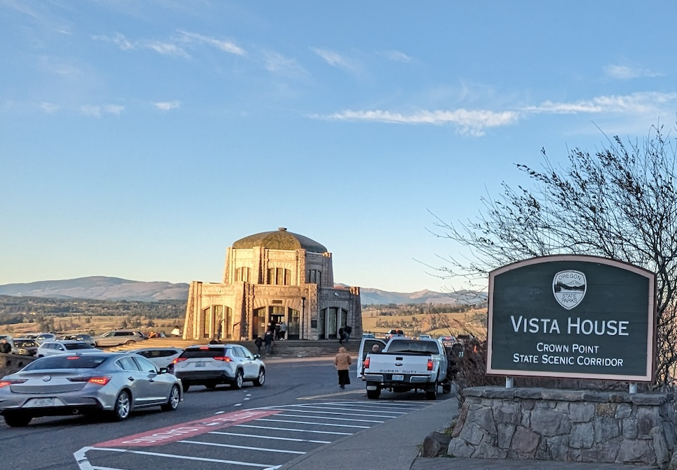

今天确实是体会到什么是“上下天光，一碧万顷，沙鸥翔集，锦鳞游泳，岸芷汀兰，郁郁青青”；而回想前两次来此看河，也确实是“淫雨霏霏，连月不开，阴风怒号，浊浪排空，日星隐曜，山岳潜形”。借着这样好的天气，我们在河谷欣赏着哥伦比亚大河奔腾向西的同时，感受到河谷狂风的激荡，再次品味了范文正公的名篇。

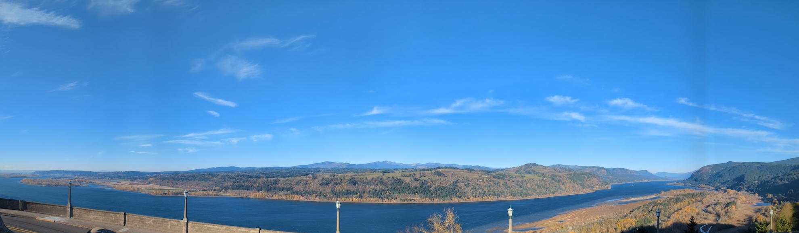

观景塔向东再行10英里，我们来到了Multnomah瀑布。车辆驶下匝道逐渐减速，右侧缓缓呈现出一条从山巅高高垂下的细长银链。停好车，我们穿过人行通道，踏入瀑布公园。尽管已是日落时分，公园里人头攒动，热闹非凡。悠然走至池塘边的观景平台，抬头仔细端详这座落差620英尺的瀑布。

瀑布分为两段：上层呈现出一股细长的水帘，从悬崖顶端飞流而下，犹如一条银色的丝带；而下层瀑布则形成了一个如同水晶般的水幕，跌落到瀑布脚下的池塘中。这个池塘反射着瀑布周围郁郁葱葱的绿色树木，为整个场景增添了一层神秘的色彩。上下层瀑布的分隔线上横跨着一座石拱桥，不仅为观赏瀑布提供了别样的视角，其古朴造型也与瀑布相得益彰，给人一种宁静深沉的感觉。

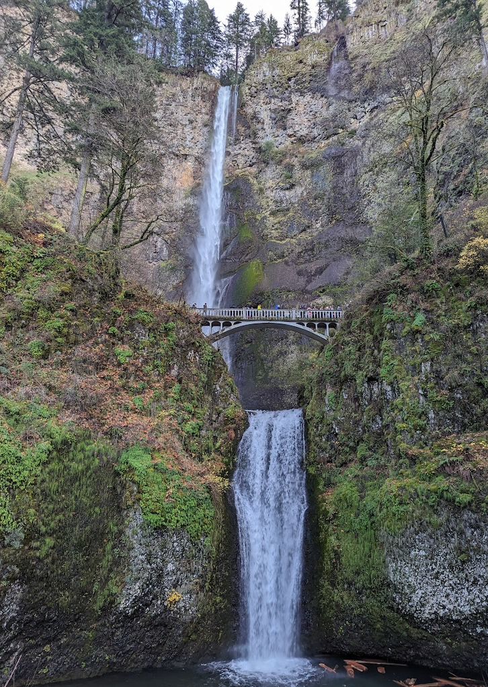

从瀑布公园出来，已是日落时分，追着紫红色的晚霞，我们回到了酒店，结束了今天的探索。

## 星期天11月26号 科技馆-回家
今天是旅程最后一天，因为弟弟下午要上课，所以只安排了上午我带着孩子们去波特兰科技馆。

波特兰科技馆的独特之处在于展出了一艘退役的常规动力潜艇，即USS Blueback。这艘潜艇是美国海军最后一艘退役的常规动力潜艇，配备有3个柴油发动机和2个电动机。潜艇内部空间如预期的那样狭小，额定载员85人，其中包括77名水兵和8名军官。除了艇长拥有独立的卧室外，其他船员都睡在水兵床上，这些床铺分布在高度仅为1米5左右的空间内，呈三层叠加，不能直立。一个有趣的发现，整艘潜艇中最受欢迎的设备之一是一台冰激凌机。据说，如果这台机器出了故障，所有值班的水兵都会争先恐后地去修理它。孩子们对参观深感兴奋，而成年人也因此得以开阔眼界。

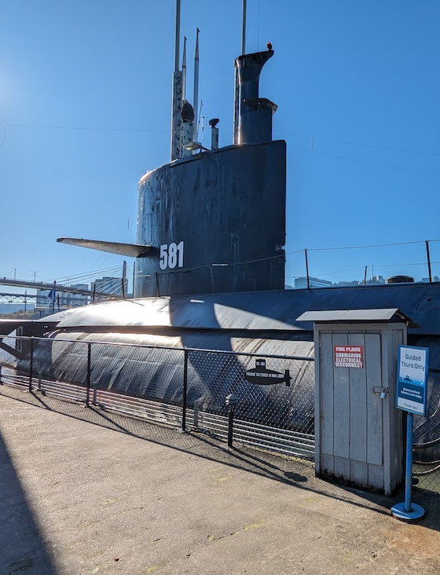

在科技馆，我们还看了其他的展区。主要是动物，包括爬行动物或者哺乳动物如何保护自己，还有人的生长发育，古生物实验室，orca的展项，物理化学实验室等等。孩子们开心的做实验玩各种游戏，而且还有各种动物的知识可以学习，确实是很不错的体验。

中午时分，参观结束，家人也汇合一处，于是我们踏上了回家的行程。

## 小结
这是一次短途road trip，除了阿斯托里亚没能玩的尽兴，基本上还是比较满意的。俄勒冈州和华盛顿州都是美国太平洋西北地区的重要州，自然资源丰富，自然风光壮观。历史虽然不长，却也记录了合众国开疆拓土的精神。第一次认真写一篇游记，记录一下过程和感想。

## Reference
地图：
[自制路线图](https://www.google.com/maps/@45.856358,-123.2751928,10z/data=!3m1!4b1!4m2!6m1!1s1SQdYx1WFfN8UcZTyTHNjG6vCJTQbTgg?entry=ttu)
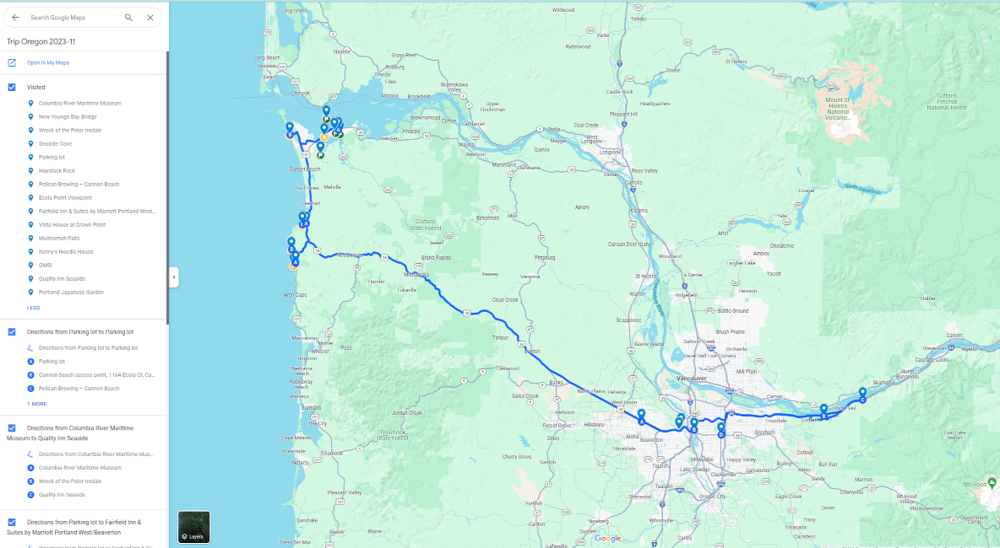

阿斯托里亚（Astoria）--建立于1811年，是落基山以西，美国最早建立的永久居住点。位于哥伦比亚河入海口附近南岸，俄勒冈州西北角。

彼得·埃尔戴尔号残骸（Wreck of Peter Iredale）-- 1906年，彼得·埃尔戴尔号在哥伦比亚河出海口附近的海滩搁浅，由于很难将船拖出，只能遗弃，因此100多年来船身慢慢腐烂，只剩残骸在这片沙滩之中。

哥伦比亚河（Columbia river）-- 位于北美太平洋西北地区，全长2,044公里，流域面积415,211平方公里。哥伦比亚河起源于洛矶山脉在加拿大不列颠哥伦比亚内的部分，向西北方向蜿蜒，然后向南流入美国境内的华盛顿州，然后沿着华盛顿州和俄勒冈州的边界向西流动，最后注入太平洋。哥伦比亚河是北美洲太平洋西北地区最大的河流，全美第四大河。1792年罗伯特·格雷船长率领哥伦比亚号发现了这条河，并将此河用自己的帆船名来命名。

加农海滩（Cannon Beach） – 俄勒冈的著名海边旅游城市，原名艾尔克溪（Elk Creek），于1922年正式改名加农海滩。改名是因为一尊短舰炮被冲上海滩，当地人由此获得灵感而改名。（加农炮=cannon）此地是美西北地区最有名的海滩之一，草垛岩（haystack rock）是海滩上最著名的景点。