今年2月初公司在洛杉矶offsite，就是集中开会+团建。由于周末就是中国年，家里决定干脆就去加州旅行过年。我周二到周五需要工作，于是安排了周五下午开车到棕榈泉市，周六去附近的约书亚树国家公园，周日去棕榈泉附近的峡谷等地。

## 周六-约书亚树国家公园(Joshua Tree National Park)
[约书亚树国家公园](https://www.nps.gov/jotr/index.htm)位于加州棕榈泉市附近，以其独特的各种奇形怪状的大石头，大量的约书亚树（短叶丝兰），圆柱仙人掌等等而闻名。整个公园处于美国西南部沙漠地带，因此这些植物和景象也属于是典型的美国西南部沙漠风光。 

早上10点左右我们从酒店开出，依次开上us111, i10和us62，差不多50分钟左右开到位于约书亚树市的约书亚树国家公园游客中心。在那里收集了资料，拿到了地图，听了工作人员关于路线的讲解，还得到了为两个小朋友提供的ranger book，期待他们在公园里能找到特殊的动植物。稍作休整后，我们继续开上通往公园的主路，进入公园，映入眼帘的是典型的沙漠莽原景色，一片土黄色的平原，间或有一些大岩石在平原上凸显。

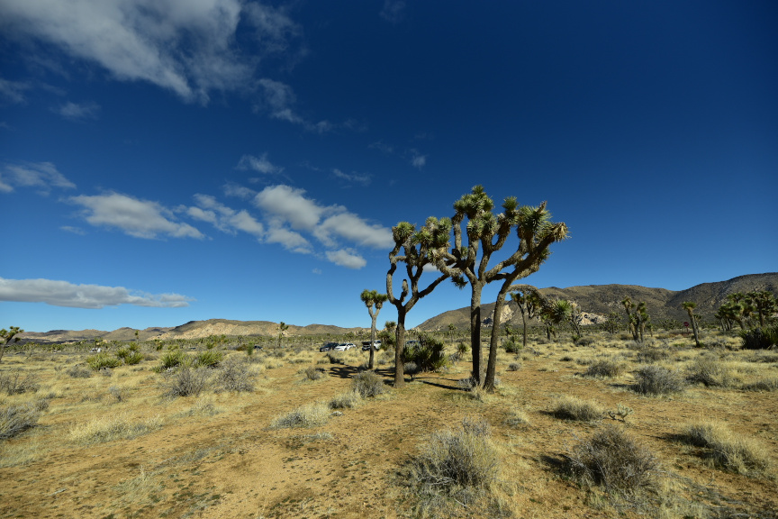

起初，平原上只有非常少的低矮灌木或者仙人掌，随着深入公园，约书亚树渐渐多了起来，不过还只是一株一株分的比较开。约书亚树比较有特色，树干不甚粗壮，基本是圆柱形，分枝不多，但是也很粗壮，没有细枝。在分枝的顶端有一蓬茂密的树叶，远远看去，确实是兰花的带状叶子，而且翠绿反光。这些分枝线条也很硬朗，很多树看上去像是粗壮的叉子一样矗立在地上。在其他低矮的灌木那黄棕色树枝树叶的衬托下，这些高高竖起的短叶丝兰越发显得引人注目，看着还有一丝丝的高傲。

### 隐秘谷Hidden Valley
来到我们第一个景点--隐秘谷。在停车场停好车，我们下车发现虽然烈日当空，可是也能感觉到一丝凉风，地上，边上大石块的石缝里等等背阴的地方还有大小不等的积雪块。此地应该属于莫哈维沙漠的一部分，海拔相对较高，冬天气温很低。

隐秘谷是一个由一大片巨型大理石小山围起来的小型谷地，有一条简易的行步道环绕谷地在大理石小山之间穿梭连通。踏入行步道，不一会儿就置身于这些大理石壁之中。大理石壁上，有各种不同的裂纹，有些组成简单的图案，也有一些裂纹使得大理石看上去像是好几块堆叠起来。黄色大石中间，还点缀着各种植物，有高一点的约书亚树，也有矮一点的仙人掌，还有一些枯萎的灌木，而背阴的角落里还能看到白色的积雪。行步道并不好走，有时要侧身从石缝中穿过，有时又要手脚并用爬上一片高台，有时更需要避开脚边的仙人掌。。。而头顶的烈日和山缝中吹来的冷风，确实也让我体会到简易版的冰火两重天，往往是前一秒还感觉头上被晒到发烫，下一秒一阵阴风吹过，浑身起鸡皮疙瘩。

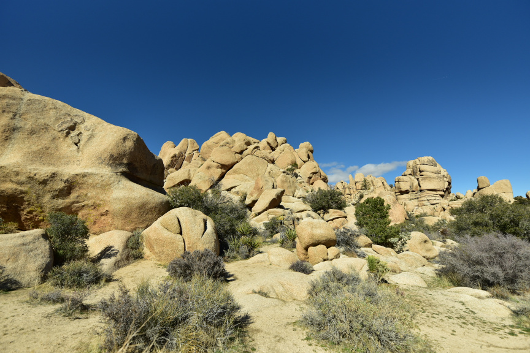

爬山途中，最有趣的还是看着无处不在的大石头，这些石头里有一些着实像极了我们生活中的物件。有的石头像动物，比如，企鹅，海象，还有的石头像鞋子，还有像独眼巨人的，像字母的等等等等。蓝天白云之下，一边欣赏着嶙峋的怪石，一边感受着沙漠中毒辣的太阳和高原上的冷风，也确实是别有一番风味。

还好，这个山间的环形行步道大概1.6公里长，最高海拔大概30米左右，还算是一个老少皆宜的简单爬山旅程。虽然不长，但是也让我们初步领略了约书亚树国家公园的独特魅力。在一些高大的岩石上，我们也看到了不畏危险的攀岩爱好者，奋勇攀爬，接受着大自然的挑战。

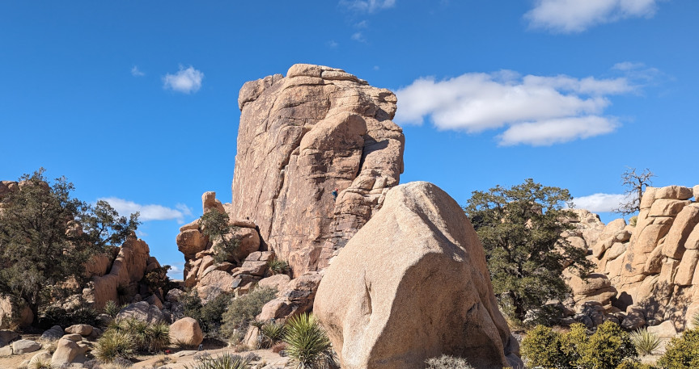

### 头骨岩Skull Rock | 爱心岩heart rock | 拱门岩Arch rock
离开隐秘谷，我们驱车顺着园区公路来探索这个公园另一个颇具名气的景观，被大自然打造成各种形态的大岩石。首先遇上的是头骨岩，顾名思义，这是一块像人头骨的大理石。下车以后我们都穿上了厚外套，朝着人群聚集的地方走去。走到合适的角度，一个巨石人头骨赫然呈现在眼前，尤其是左眼框，空洞幽深，配合“鼻骨”以及周边的石块构成的“头骨”构造，还真是栩栩如生。

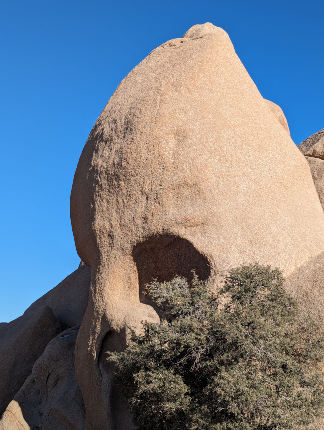

孩子们对于头骨岩看一眼就没了兴趣，转而开始在周围的几个大石头块上开始攀爬玩耍。有时候也不得不佩服孩子们的平衡能力和冒险精神阿哈哈哈，不过想想我们小时候不也是和小猴子一样到处窜高爬低的么。

随着时间推移和海拔升高，温度越来越低，不过我们还是来到另外两个比较有特色的岩石景点，爱心岩和拱门岩的所在地。去到2个岩石需要走一段小径，穿梭在不同形态的约书亚树中间，还是很有新奇的感觉。这些树，有些高大威猛，有些矮小精干，有些妖娆多姿，给平淡的荒原增添了不少趣味。

小径穿过公路，将我们引入一片乱石山区，看着路边的牌子上的指示标志我们很快找到了爱心岩通路。经过一阵奋力攀登（其实就是想办法跟上石头山缝隙中的小路走上更高的石头，倒也不需要手脚并用），远远的看到一块形似爱心的硕大岩石神奇的立在石台之上，爱心底下的尖角略成弧形和地面接触，稳稳地支撑起整个岩石。在夕阳的照射下，黄色的岩石已经有点橙色的光泽，给人以更加浪漫的感觉。

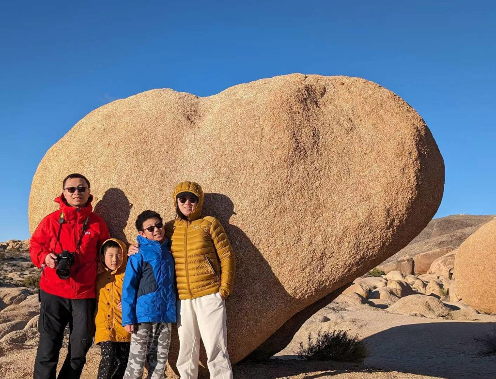

离开爱心岩，我们开始专心寻找通向拱门岩的道路。在不靠谱的路牌的指引下，我们在石头山里绕起了路，围着几个大石头转了好几圈，楞是没有找到。大石头看到不少，冷风也喝了不少，尤其太阳下山在即，这时候的风吹到脸上，那真和刀子割有一拼。不过呢，走这几圈也让我切实领略了微缩版的“横看成岭侧成峰，远近高低各不同“，各种造型的石头换一个方向就是另一番景象，如果没有其他的参照物还真挺容易让人迷路呢。好在最后问到了刚到过的游客，顺手指着说前面台阶下去转弯就到，恩，虽然不是“牧童遥指杏花村”，不过也确实是给我们指明了方向。我三步并作两步，下到台阶最底下一转身，嗬！原来拱门藏在一个小谷地里其他岩石后面，真是“踏破铁鞋无觅处，得来全不费功夫“。

拱门岩是一块巨大的岩石，在地质作用下，中间被镂空出一块弧形空间，类似于在石壁上掏出一扇巨大的拱门。只不过大自然的手法更加浑然天成，让人看了叹为观止。有不少游客爬到弧顶最上方，不过更多的还是爬到拱门里面让人拍照。

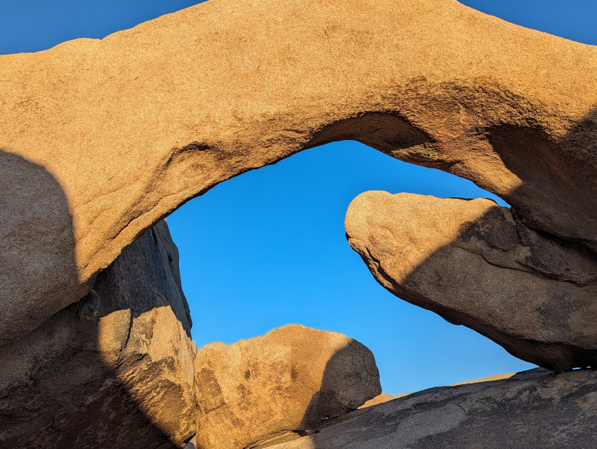

眼看太阳已经搭上了远处的山头，我们匆匆取景拍照，然后顶着寒风一路走回车里，准备去往公园里最后一个景点。

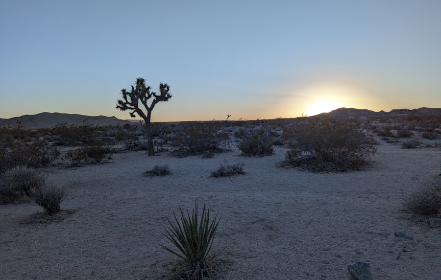

### 仙人掌花园Cholla Cactus Garden
赶在太阳完全下山之前，我们来到了最后一个景点Cholla Cactus Garden。Cholla Cactus暂时没找到准确的翻译，肯定是某种圆柱仙人掌属。百度百科称呼泰迪熊仙人掌，姑且就叫泰迪熊仙人掌花园。这种仙人掌远远看感觉毛茸茸的，而且大部分低矮圆润，感觉不象正常的仙人掌那么的危险，不过据说这种仙人掌的刺一旦沾上，很难清理，还是小心为妙。停车场边上的沙石地上一大片的低矮的仙人掌望不到边际，间或有一些高大的仙人掌耸立其中，中间隐约看出一些曲径通幽，确实和一个大花园似的，只不过现在仍是冬天，只能看到浅绿色圆柱状的仙人掌肉茎和毛茸茸的尖刺，花还不是很明显。夕阳余晖之下，人们纷纷抓紧时间匆匆穿梭于花园之中，和各式各样的仙人掌留下了亲切的合影。

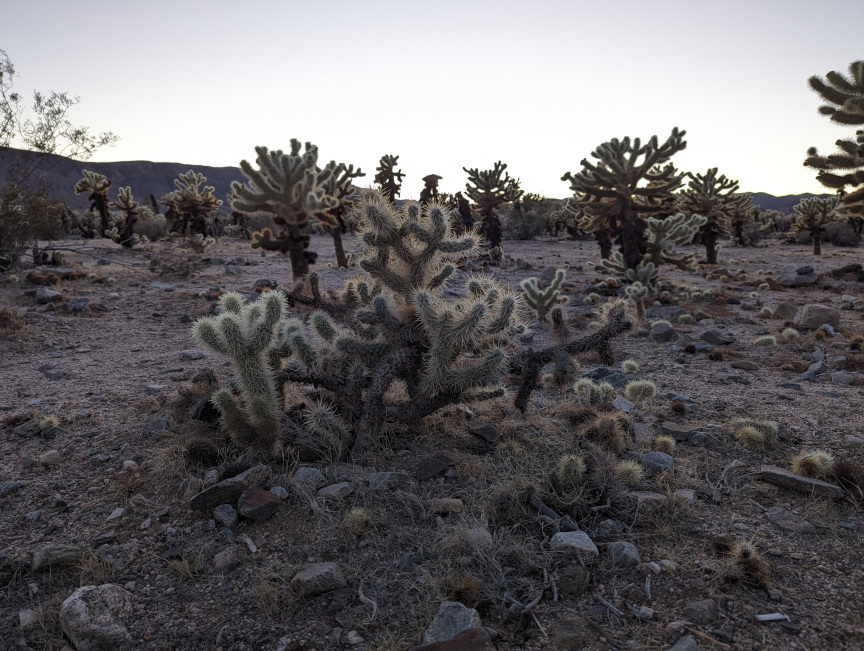

由于天色已晚，我们也在参观了花园之后就踏上了返回棕榈泉的道路。其实整个公园还有很多地方可以去欣赏，有不同的岩石，有沙漠中的绿洲，还有更大片的约书亚树林以及不同的动植物。由于时间限制，希望以后还能有机会来到这片神奇的沙漠莽原。

## 周日-棕榈泉周边
在酒店睡了一个好觉，早上起来吃饱喝足，收拾行装，我们准备开启第二天的旅程。第一站是棕榈泉附近的印第安峡谷。

### 印第安峡谷Indian Canyons
开车20来分钟，我们就来到了棕榈泉市西南面的山区，进入峡谷公园。印第安峡谷公园有几个不同大小的峡谷，在这些峡谷中发现有不少印第安人生活的遗迹，因此将这一块区域组成一个旅游区域。在拿到地图一番研究以后，我们决定还是去一个比较好走的安德烈斯峡谷探索一番。

很快开到峡谷停车场，最先映入眼帘的是一簇一簇大棵的棕榈树。和一般印象中的棕榈树一根略显细长的树干顶着大片的棕榈叶不同，这些棕榈树的树干显得很是高大粗壮，外面是黄色的棕榈叶包裹，而顶上的绿色叶片也就不显得那么大了。

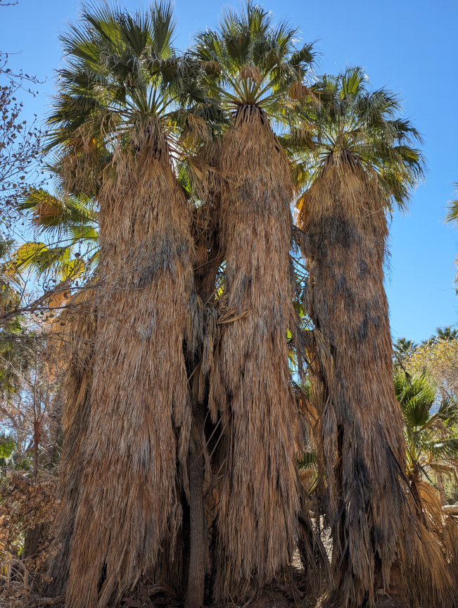

在棕榈树的遮蔽之下，一条小溪若隐若现，在身边湍湍流淌，这就是安德烈溪。我们在溪边一边走上缓缓的山路，一边欣赏棕榈溪水相映成趣。山路的另一边先是陡然直立的山壁石壁，然后变成铺满植物的缓坡，这也意味着我们越爬越高。

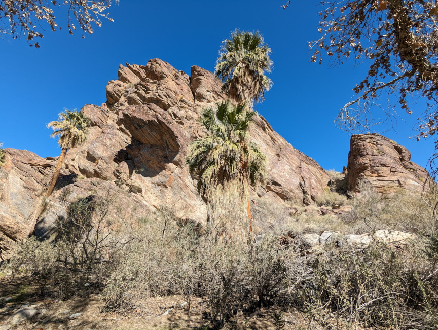

石缝中偶尔蹿出的壁虎给旅途增加了不少乐趣。溪水曲折，树荫遮蔽，溪流时而绕树而过，时而从石阶上奔下形成一个小小瀑布，时而转去意想不到的方位，需要仔细方能寻者溪流的踪影，恍惚间，竟然让我有来到九溪十八涧的错觉。

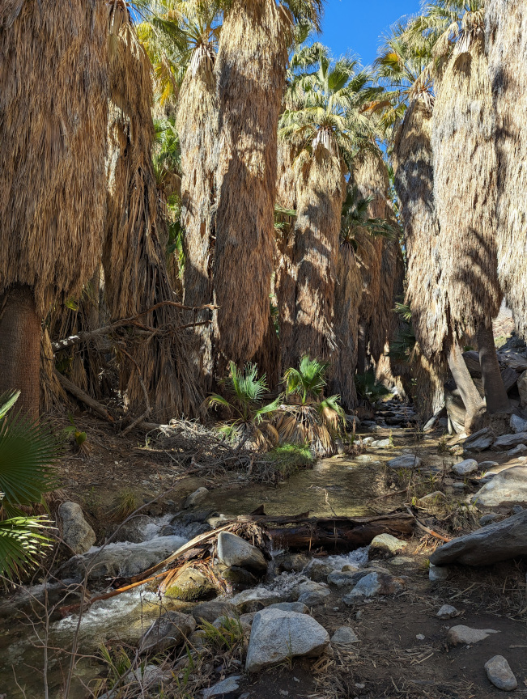
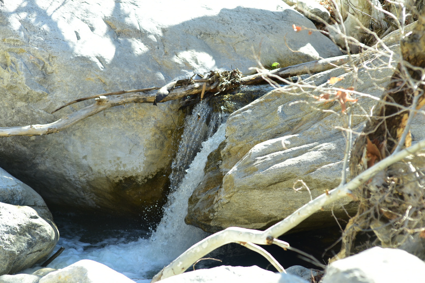

一路溯溪而上，不久就见一略高的瀑布，离瀑布不远有一座简易的木桥。跨过木桥，迈上一段陡坡，眼前豁然开朗，我们已到溪水另一边的高地之上。举目远眺，万里无云，高高的天是湛蓝的，远处的树是翠绿的，脚下的路是土黄的，周围的山石是棕黄的。

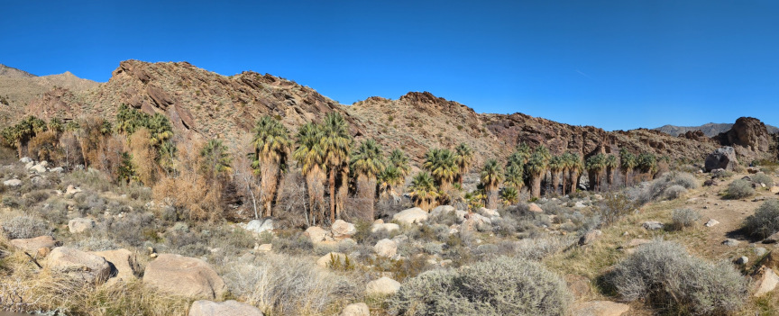

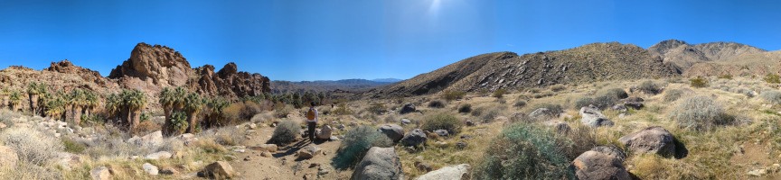

没有了棕榈树的遮挡，邻近中午的太阳直射地面，热浪扑面，和刚才溪边树荫的阴凉惬意形成了鲜明的对比。来到高地边上，俯瞰溪水峡谷，看着溪水边上的人在棕榈树间若隐若现，似乎也看到了刚才的我们。由于地势变高，我们现在看棕榈树顶终于可以平视甚至是俯视了，感觉上高到的棕榈树变成了大号的灌木丛，远远和我们相望。

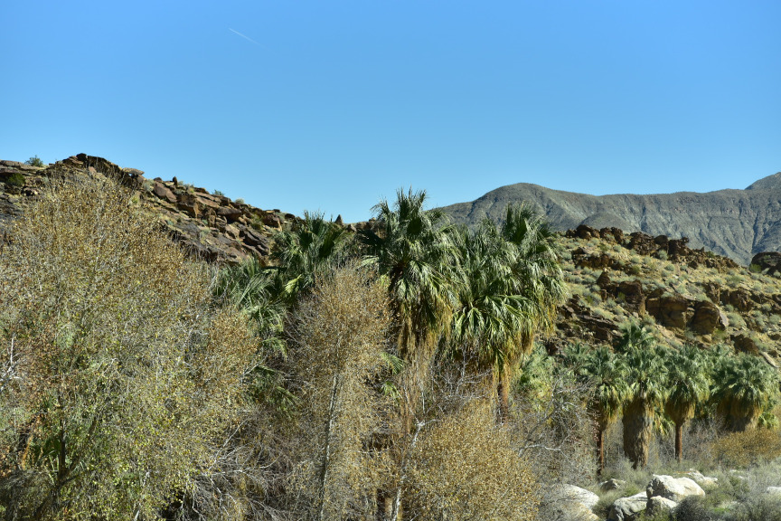

走完这条峡谷，我猛然意识到这大概就是棕榈泉市的名字由来吧。。。

### 棕榈泉市
从峡谷出来，我们在附近的沙漠野生动物园稍作游览，没有什么特别值得记录的就一笔带过吧。

离开动物园，我们返回棕榈泉市逛逛。市中心是靠近山脉的几个街区组成，主街上各式各样的餐馆咖啡店也是很热闹了。

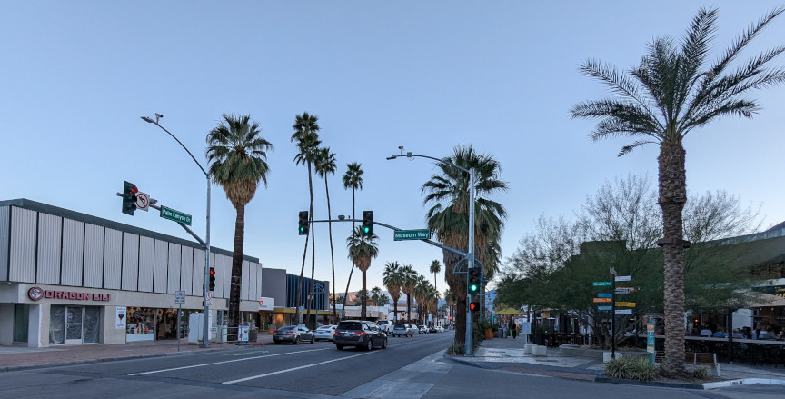

在市中心艺术博物馆外面有一座名为Forever Marilyn的玛丽莲梦露的巨型雕像。雕像展示的是她在《七年之痒》里的经典的压裙子动作。雕像确实做得很逼真，把梦露的美貌以及电影里的经典动作刻画得栩栩如生。

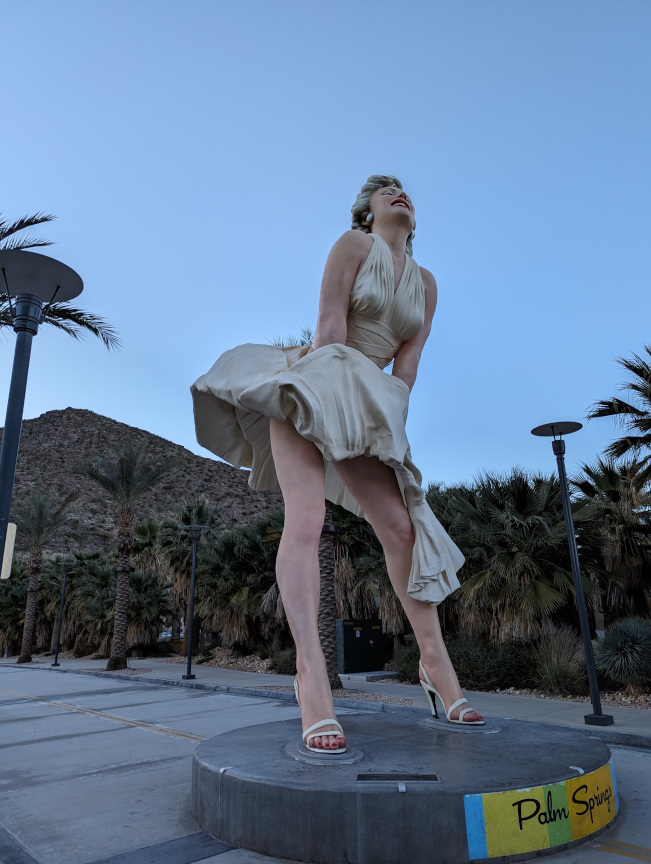

棕榈泉整个城市不大，主要的产业就是旅游，另外套用咱们中国人的说法就是疗养，有不少有特色的酒店。由于此地干热的气候，对很多人（比如我们大西雅图地区的人）是冬天疗养的好地方。据说不少好莱坞的明星会来棕榈泉度假，因此也有丰富的娱乐项目。

傍晚时分，我们离开这座精致的小城，前往机场，登上了回家的航班。

## 回溯和地图
由于这次还要照顾到工作的情况，还有过年的情况，两天的时间在棕榈泉附近包括国家公园玩其实有点紧张，不过能领略到这不同的风光和比西村温暖（也寒冷）的气候还是物有所值。下面是一个简易的[路线图](https://www.google.com/maps/d/u/0/edit?mid=1tmwiRY8aqIS8E0NN8pkqKzJIgIzNWwc&usp=sharing)。

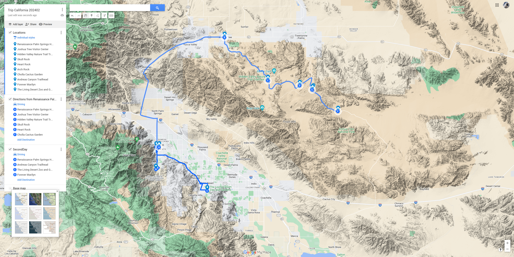

